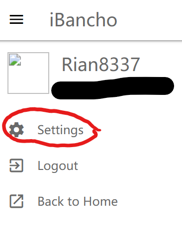

#### Can I change my registered email, password, and in-game name?

For registered email and password:

1. Go to this page and login with your osu!droid account credentials (in-game name and password).
2. Once you’re logged in, go to settings. In there, you can change your email and password.

The settings button that you will need to press after you login to the page.
Do note that **you cannot change your email if the new email is connected to another osu!droid account.**

For in-game name, you need to request a name change. Go to #bot-ground and type /namechange request email:(your account's email) newusername:(your new username) to request a name change.

<!-- Don't touch this part thank you -->
